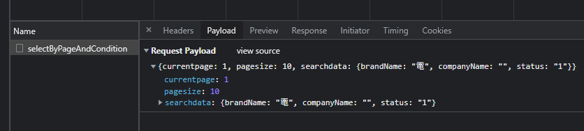
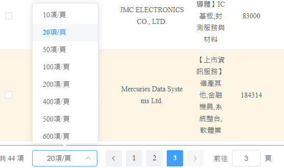

# 說明

* 本練習係學習使用Vue學習資料雙向綁定，使用Axios組件發送異步請求實現資料庫增刪改查，並使用基於Vue的網站組件庫：Element(Plus)來美化頁面效果，本練習已內建兩組帳號密碼如下：
  * 帳號：testac01 密碼：password
  * 帳號：testac02 密碼：password
* 練習結果如下：
  * 練習首頁

    * 
  * 登入頁面(透過Filter過濾未登入之用戶)

    * 
    * 
  * 登入後進入展示頁(包含未使用Element的簡易版，及使用Element的華麗版)

    * 簡易版
      * 
      * 
    * 華麗版
      * 
      * 
  * 功能展示(以華麗版進行展示)

    * 查詢
      * 查詢所有(進入頁面或查詢條件為空點選查詢即為查詢所有)
        * 
        * 
      * 條件查詢
        * 
        * 
        * 
        * 
      * 分頁查詢(依頁面設定之每頁展示筆數及目的頁，向資料庫發送異步請求)
        * 
        * 
        * 
        * 
    * 新增(點選新增彈出填寫表單，新增完成後續依既有條件查詢)
      * 
      * 
      * 
      * 
      * 
      * 
      * 
      * 
      * 
    * 修改(點選該列修改按鈕彈出填寫表單，修改完成後續依既有條件查詢)
      * 
      * 
      * 
      * 
      * 
      * 
      * 
      * 
      * 
    * 刪除
      * 單筆刪除(點選該列刪除按鈕彈出確認提醒，點選取消則取消當前操作，點選確定則進行刪除，完成後續依既有條件查詢)
        * 
        * 
        * 
        * 
        * 
        * 
        * 
      * 批量刪除(勾選左列待刪除項，點選批量刪除按鈕彈出確認提醒，點選取消則取消當前操作，點選確定則進行刪除，完成後續依既有條件查詢)
        * 
        * 
        * 
        * 
        * 
        * 
        * 
        * 
        * 
